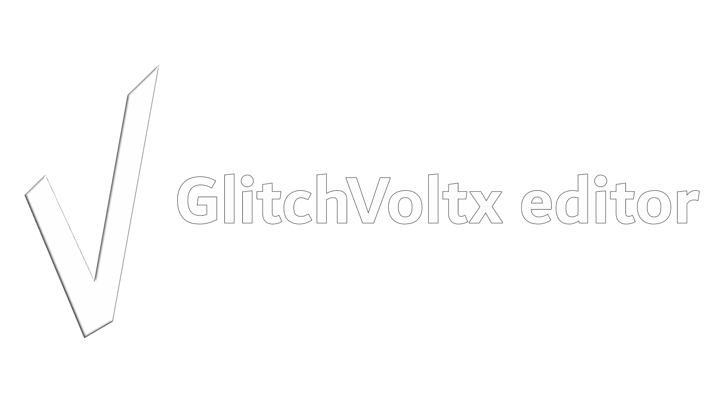
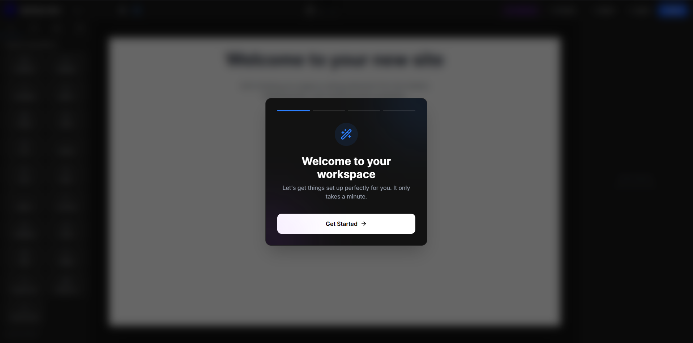
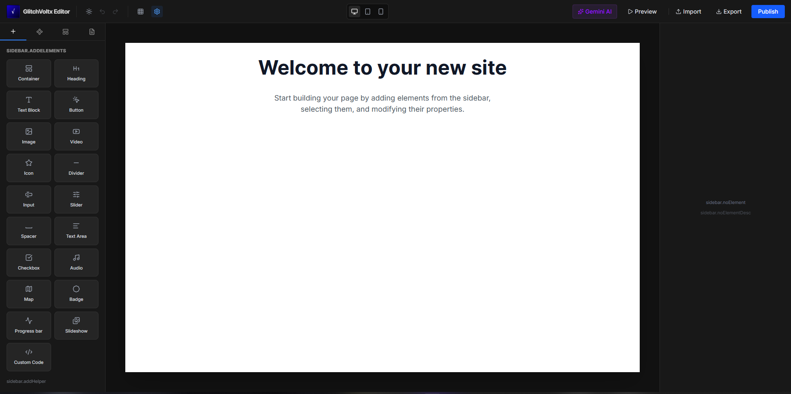
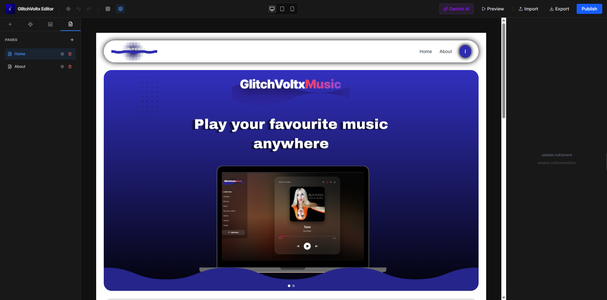

# GlitchVoltx Editor

<div align="center">



[](https://opensource.org/licenses/MIT)
[](https://github.com/glitchvoltx/GlitchVoltx-editor)
[](https://github.com/glitchvoltx/GlitchVoltx-editor)

**The Free, Open-Source Visual Website Builder with AI & GSAP Animations**

[Features](#features) • [Quick Start](#quick-start) • [Documentation](#documentation) • [Demo](#demo) • [Contributing](#contributing)

</div>

---

## 📖 Overview

**GlitchVoltx Editor** is a production-ready visual website builder that combines the power of **GSAP animations**, **AI-powered features**, and **intuitive drag-and-drop design**—all in one free, open-source platform.

Built for creators, developers, and designers who want professional-grade web design tools without the subscription fees.

### ✨ Why Choose GlitchVoltx?

-  **100% Free** - No monthly fees, no limits
-  **GSAP-Powered** - Professional animations built-in
-  **AI Integration** - Smart features like automatic sitemap generation
- **Bilingual** - English + Japanese support (more coming!)
-  **Clean Exports** - Production-ready HTML/CSS/JS
-  **Open Source** - Customize, extend, and contribute

---

## 🎯 Features

### 🎨 Visual Builder
- **Drag-and-Drop Interface** - Intuitive element placement
- **Real-Time Preview** - See changes instantly
- **Responsive Design** - Mobile-first approach
- **Custom Components** - Containers, forms, media, and more

### 🎬 GSAP Animation Engine
- **ScrollTrigger** - Scroll-based animations
- **Draggable Elements** - Interactive user experiences
- **Text Animations** - Typewriter effects & reveals
- **Stagger Effects** - Beautiful entrance animations
- **Professional Easings** - Power1-4, elastic, bounce, back

### 🤖 AI-Powered Features
- **Smart Sitemap Generator** - Auto-create XML sitemaps with Gemini AI
- **SEO Optimization** - Meta tags, OG data, structured data
- **Google Search Console** - Built-in verification support

### 🌐 Publishing & Export
- **Clean HTML Export** - Semantic, accessible code
- **ZIP Download** - All assets bundled together
- **One-Click Publish** - Deploy-ready output
- **SEO Settings Panel** - Title, description, verification codes
- **Custom Head Injection** - Analytics, fonts, scripts

### 🌍 Internationalization
- 🇬🇧 English (Full Support)
- 🇯 日本語 (Beta - Community Contributions Welcome!)
- 🌐 More languages coming soon

---

## 🚀 Quick Start

### Installation

```bash
# Clone the repository
git clone https://github.com/glitchvoltx/GlitchVoltx-editor.git

# Navigate to the directory
cd GlitchVoltx-editor

# Install dependencies
npm install

# Start development server
npm run dev

```
## Showcase



